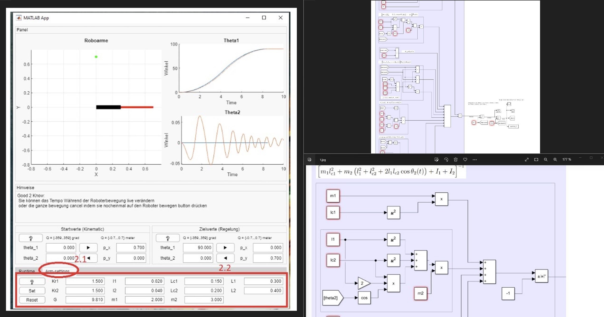

# Planar Robot

MATLAB/Simulink project for a 2-DOF planar robot arm. Forward/inverse kinematics, trajectory planning, PID control, and a GUI built with App Designer.

## How it works

The GUI (`src/Robo.mlapp`) visualizes a two-link robot arm in 2D. You set start and target joint angles (theta_1, theta_2), configure arm parameters (link lengths L1/L2, masses m1/m2, center of mass Lc1/Lc2, inertias I1/I2, control gains Kr1/Kr2), and watch the arm move with real-time plots of joint angles over time.

The Simulink model (`src/Controlled_PlanarRobot.slx`) implements the Lagrangian dynamics with torque calculations, trig functions for coupling terms, and integrators for state propagation. The control loop uses PID feedback with configurable gains.

## Source files

| File | What it does |
|------|-------------|
| `src/Robo.mlapp` | App Designer GUI with arm visualization, parameter inputs, and live plots |
| `src/Controlled_PlanarRobot.slx` | Simulink model with dynamic equations and PID control loop |
| `src/fun_callForwardKin.mlx` | forward kinematics: joint angles → end-effector position |
| `src/fun_callInvKin.mlx` | inverse kinematics (analytical): target position → joint angles |
| `src/fun_callInvKin_Num.mlx` | inverse kinematics (numerical/iterative) |
| `src/fun_callTraj.mlx` | trajectory planning: smooth interpolation between positions |
| `src/fun_checkWorkspace.mlx` | workspace analysis: reachable area for given arm parameters |
| `src/fun_drawRobo.mlx` | 2D robot arm rendering |
| `src/fun_moveRobo.mlx` | animated robot movement |

Full documentation in `docs/Projekt_export.pdf`.

## Screenshot

